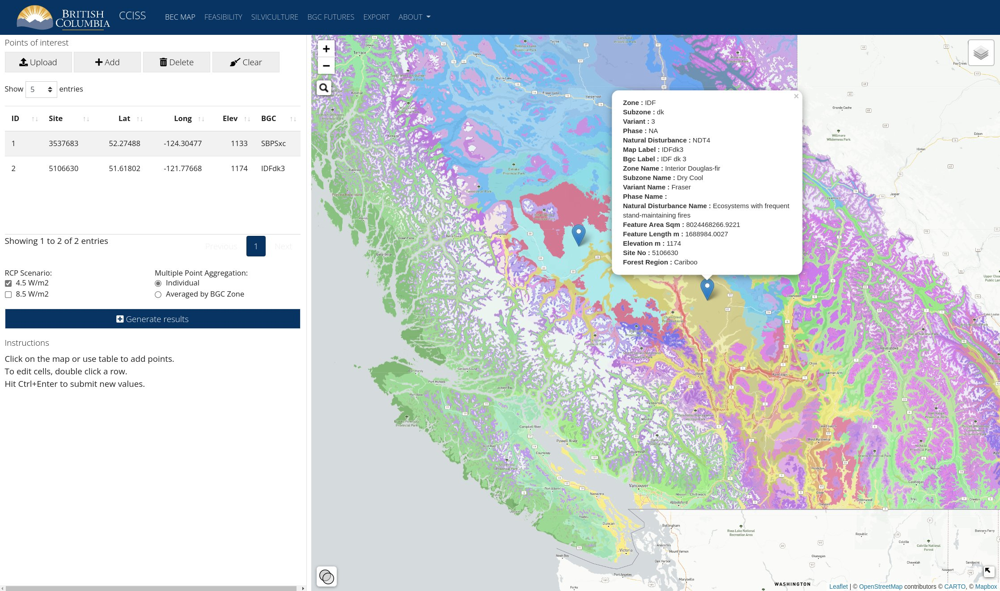
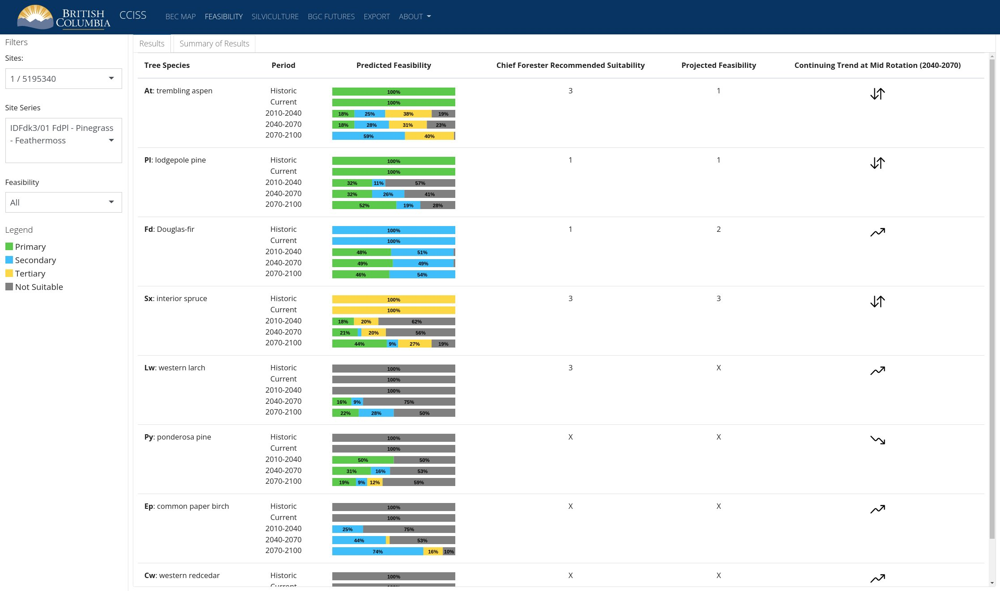
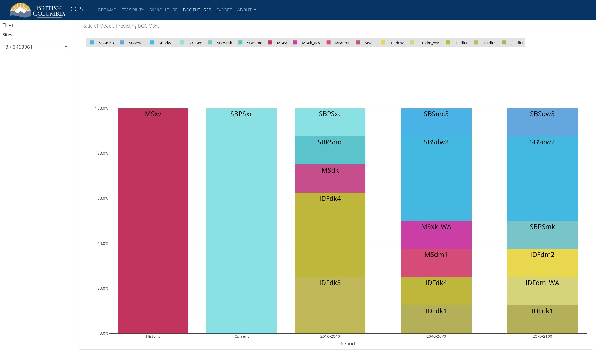
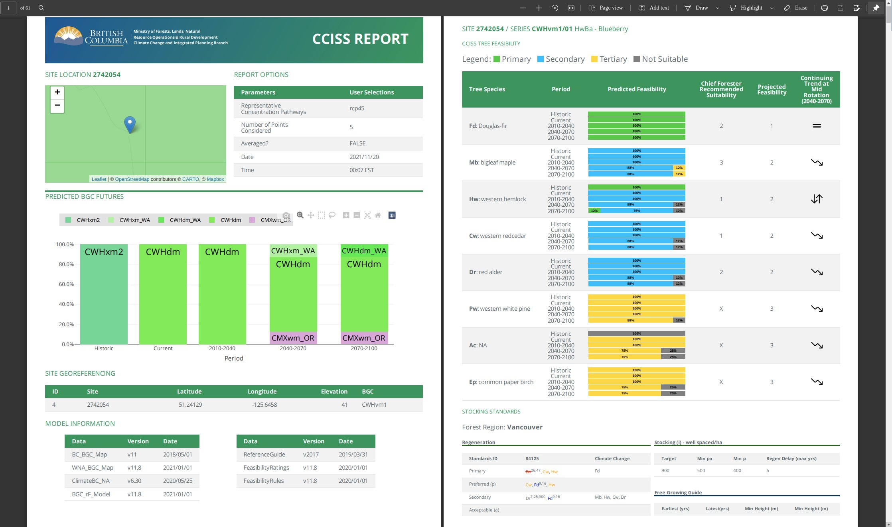
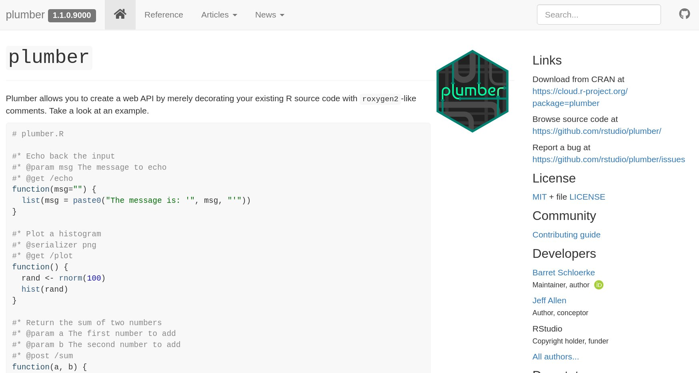

```{r setup, include=FALSE}
library(htmltools)

if (requireNamespace("thematic")) 
  thematic::thematic_rmd(font = "auto")

colors <- function() {
  
  colors <- c(
    "btn-warning",
    "btn-info",
    "btn-primary",
    "btn-dark",
    "btn-danger"
  )
  i <- 1
 
  return(
    list(color = function() {
      on.exit({
        colors <<- c(colors[-1], colors[1]) 
      })
      colors[1L]
    })
  )
}

col <- colors()

card_deck <- function(...) {
  div(class = "bd-services", ...)
}

card <- function(title, text, icon) {
  list(
    tags$button(
      type = "button",
      class = paste("btn", col$color(), "fs-2 btn-lg"),
      `data-bs-toggle` = "collapse",
      `data-bs-target` = paste0("#collapse", gsub(".", "_", make.names(title), fixed = TRUE)),
      `aria-expanded` = "false",
      `aria-controls` = paste0("collapse", gsub(".", "_", make.names(title), fixed = TRUE)),
      span(span(class = paste0("ion ion-", icon)), title)
    ),
    div(class="row collapse", id = paste0("collapse", gsub(".", "_", make.names(title), fixed = TRUE)),
      div(class = "col",
        div(class = "card card-body",
          text
        )
      )
    )
  )
}
```

<style>
  .section-head h2, h6 {
     text-align:center;
     padding-bottom: 28px;
  }
  .section.level2 {
    padding-top: 75px;
    min-height: calc(100vh - 85px);
  }
  .nav-tabs {
    justify-content: center !important;
  }
  body {
    padding-bottom: 5px !important;
    background: linear-gradient(180deg, #1c1c1c 25%, #11AEED 150%) fixed;
  }
  .bd-services>.btn {
    margin: 1rem 0.5rem;
  }
</style>

## <span class="ion ion-forward" style="transform: scale(1, -1);"></span> SERVICES {.section-head}

```{r echo=FALSE}
card_deck(
  card("Applications Shiny", "Vos utilisateurs veulent interagir avec vos données? Tableaux de bord, visualisations, alimenter par une base de données. Nous écrivons des applications rapides, extensibles et bien documentées. Shiny est une belle approche pour démocratiser l'information qui réside chez vous.", "star"),
  card("Interfaces Plumber", "Vous désirez rendre disponible des calculs R au reste de votre organisation? Une façon simple d'y arriver est d'utiliser Plumber. Nous facilitons son utilisation par vos équipes pour les aider à l'exploiter à son plein potentiel.", "wrench"),
  card("Optimisation de code", "Un programme utilise trop de ressources? Besoin qu'il s'exécute plus vite? Nous pouvons définitivement vous aider. Nous sommes passionnés de performance, avec jugement. Parfois, une amélioration de 80% va suffire et c'est correct. On peut aussi pousser plus loin en transférant en C++.", "code-working"),
  card("Développement de package", "Soit pour collaborer sur des packages publics ou pour mettre en place un minicran interne avec vos packages, nous sommes toujours prêts à contribuer. Les packages sont la meilleure façon de partager du code.", "pull-request"),
  card("Urgence technique", "C'est inévitable, un problème en production est si vite arrivé. Une image Docker refuse de coopérer. Les performances régressent suite à un nouveau déploiement. Vous en avez besoin hier et il y a énormément de pression sur vos équipes. Nous avons été dans cette situation et avons trouvé des solutions alors que plusieurs auraient abandonné.", "bug"),
  card("R comme SIG", "R a une panoplie de packages pour travailler avec les données géographiques. Ils peuvent remplacer un outil dédié dans plusieurs cas. Vos géographes pourraient en bénéficier. Nous pouvons aussi créer des cartes et des mosaïques vectorielles personnalisées pour vos besoins.", "map"),
  card("Ingénierie des données", "90% du temps est passé à convertir et traiter les données. Nous définissons des flux de transformation des données pour alimenter l'entraînement des modèles. Lorsque les modèles sont prêts, on prend le relais pour déployer en production.","social-buffer"),
  card("Preuve de concept", "Déterminer rapidement si vous pouvez extraire de la valeur de vos données. De plus, nous pouvons réviser vos modèles existants. Les meilleurs modèles proviennent d'experts en la matière. Nous les assistons avec les outils et les processus pour livrer de la valeur.", "flash"),
  card("Régression linéaire", "Qui a dit que des techniques simplifiées ne pouvaient pas résoudre des problèmes concrets. L'apprentissage profond n'est pas la solution à tout. Choisir le bon outil selon le contexte.", "ios-pulse-strong"),
  card("Amélioration du gradient", r"(L'amélioration ("boosting") du gradient est une technique pratique. Cependant, ça peut être embêtant de configurer les hyperparamètres. On peut vous aider à vous y retrouvez.)", "android-options"),
  card("Infonuagique", HTML("Nous travaillons avec la plupart des fournisseurs qui offrent de l'infrastructure au Canada. L'infonuagique est parfaite pour les besoins extrêmes sporadiques et la puissance à la demande.<ul><li>Google</li><li>DigitalOcean</li><li>Azure</li><li>AWS</li></ul>"), "android-cloud"),
  card("Intégration et déploiement en continu", "Utilisez les actions avec GitHub ou des outils similaires pour automatiser les tâches répétitives liées à la gestion du code. Tester, valider et mettre en production tout en un. Profitez de la conteneurisation des applications quand c'est favorable.","loop"),
  card("Environnement de travail", "Nous pouvons configurer des serveurs RStudio, Shiny ou Jupyter Notebook. On prend en charge la sécurisation, nginx et l'installation des moteurs d'exécution pour les notebooks. On peut également compiler les librairies GPU nécessaires à l'apprentissage machine. Comme ça, vous n'aurez pas à creuser dans la documentation de CUDA.", "monitor")
)
```

## PROJETS <span class="ion ion-forward" style="transform: scale(-1, -1);"></span> {.tabset .tabset-fade .section-head .tabset-pills .nav-justified}

### CCISS

```{r echo=FALSE}
HTML('
<div id="carouselCCISS" class="carousel slide" data-bs-ride="carousel">
  <div class="carousel-indicators">
    <button type="button" data-bs-target="#carouselCCISS" data-bs-slide-to="0" class="active" aria-current="true" aria-label="Carte Interactive"></button>
    <button type="button" data-bs-target="#carouselCCISS" data-bs-slide-to="1" aria-label="SVG Généré"></button>
    <button type="button" data-bs-target="#carouselCCISS" data-bs-slide-to="2" aria-label="Graphique"></button>
    <button type="button" data-bs-target="#carouselCCISS" data-bs-slide-to="3" aria-label="Rapport PDF"></button>
  </div>
  <div class="carousel-inner">
    <div class="carousel-item active">
      
      <div class="carousel-caption d-none d-md-block">
        <h5 style="background-color:white">Carte Interactive</h5>
      </div>
    </div>
    <div class="carousel-item">
      
      <div class="carousel-caption d-none d-md-block">
        <h5 style="background-color:white">SVG Généré</h5>
      </div>
    </div>
    <div class="carousel-item">
      
      <div class="carousel-caption d-none d-md-block">
        <h5 style="background-color:white">Graphiques dynamiques</h5>
      </div>
    </div>
    <div class="carousel-item">
      
      <div class="carousel-caption d-none d-md-block">
        <h5 style="background-color:white">Rapport PDF</h5>
      </div>
    </div>
  </div>
  <button class="carousel-control-prev" type="button" data-bs-target="#carouselCCISS" data-bs-slide="prev">
    <span class="carousel-control-prev-icon" aria-hidden="true"></span>
    <span class="visually-hidden">Précédent</span>
  </button>
  <button class="carousel-control-next" type="button" data-bs-target="#carouselCCISS" data-bs-slide="next">
    <span class="carousel-control-next-icon" aria-hidden="true"></span>
    <span class="visually-hidden">Suivant</span>
  </button>
</div>
')
```

<div class="card card-body"><p>
Application Shiny pour la sélection des espèces d'arbres en fonction des changements climatiques.
</p><div class="d-grid gap-1 col-12 mx-auto" style="padding-top:12px"><a href="https://github.com/bcgov/CCISS_ShinyApp" class="btn btn-primary btn-lg">Explorer sur GitHub <span class="ion ion-social-github"></span></a></div></div>

### Plumber

```{r echo=FALSE}
HTML('
<div id="carouselPlumber" class="carousel slide" data-bs-ride="carousel">
  <div class="carousel-indicators">
    <button type="button" data-bs-target="#carouselPlumber" data-bs-slide-to="0" class="active" aria-current="true" aria-label="plumber doc"></button>
  </div>
  <div class="carousel-inner">
    <div class="carousel-item active">
      
    </div>
  </div>
  <button class="carousel-control-prev" type="button" data-bs-target="#carouselPlumber" data-bs-slide="prev">
    <span class="carousel-control-prev-icon" aria-hidden="true"></span>
    <span class="visually-hidden">Précédent</span>
  </button>
  <button class="carousel-control-next" type="button" data-bs-target="#carouselPlumber" data-bs-slide="next">
    <span class="carousel-control-next-icon" aria-hidden="true"></span>
    <span class="visually-hidden">Suivant</span>
  </button>
</div>
')
```

<div class="card card-body"><p>
Contributeur du package [plumber](https://github.com/rstudio/plumber) et responsable de [plumberDeploy](https://github.com/meztez/plumberDeploy), [redoc](https://github.com/meztez/redoc), et [rapidoc](https://github.com/meztez/rapidoc) distribués par le CRAN.
</p><div class="d-grid gap-1 col-12 mx-auto" style="padding-top:12px"><a href="https://github.com/rstudio/plumber" class="btn btn-primary btn-lg">Explorer sur GitHub <span class="ion ion-social-github"></span></a></div></div>

### Big Query Storage

```{r echo=FALSE}
HTML('
<div id="carouselBQS" class="carousel slide" data-bs-ride="carousel">
  <div class="carousel-indicators">
    <button type="button" data-bs-target="#carouselBQS" data-bs-slide-to="0" class="active" aria-current="true" aria-label="demo"></button>
  </div>
  <div class="carousel-inner">
    <div class="carousel-item active">
      
    </div>
  </div>
  <button class="carousel-control-prev" type="button" data-bs-target="#carouselBQS" data-bs-slide="prev">
    <span class="carousel-control-prev-icon" aria-hidden="true"></span>
    <span class="visually-hidden">Précédent</span>
  </button>
  <button class="carousel-control-next" type="button" data-bs-target="#carouselBQS" data-bs-slide="next">
    <span class="carousel-control-next-icon" aria-hidden="true"></span>
    <span class="visually-hidden">Suivant</span>
  </button>
</div>
')
```

<div class="card card-body"><p><code>bigrquerystorage</code> est un package R pour BigQuery Storage API. La motivation principale est de remplacer <code>bigrquery::bq_table_download</code>.<br><br>Le package est un mixte de C++ et R.</p><div class="d-grid gap-1 col-12 mx-auto" style="padding-top:12px"><a href="https://github.com/meztez/bigrquerystorage" class="btn btn-primary btn-lg">Explorer sur GitHub <span class="ion ion-social-github"></span></a></div><div>

## <span class="ion ion-forward" style="transform: scale(1, -1);"></span> PERSONNES {.section-head}

```{r echo=FALSE}
HTML('
<div class="row row-cols-1 row-cols-md-3 g-4">
  <div class="col">
    <div class="card h-100" style="width: 18rem;">
      
      <div class="card-body">
        <h5 class="card-title">Bruno Tremblay</h5>
        <p class="card-text">Propriétaire · Actuaire · Programmeur</p>
        <div class="display-5">
          <a href="https://www.linkedin.com/in/bruno-tremblay-508ba9201/" title="LinkedIn"><span     class="ion-social-linkedin"></span></a> <a href="https://github.com/meztez"     title="GitHub"><span class="ion ion-social-github"></span></a> <a     href="https://twitter.com/meztez2" title="Twitter"><span class="ion     ion-social-twitter"></span></a>
        </div>
      </div>
    </div>
  </div>
  <div class="col">
    <div class="card h-100" style="width: 18rem;">
      
      <div class="card-body">
        <h5 class="card-title">François Bornais</h5>
        <p class="card-text">Propriétaire · Actuaire · Programmeur</p>
        <div class="display-5">
          <a href="https://www.linkedin.com/in/fran%C3%A7ois-bornais-fcas-67877736/"     title="LinkedIn"><span class="ion-social-linkedin"></span></a> <a     href="https://github.com/FrankBornais" title="GitHub"><span class="ion     ion-social-github"></span></a> <a href="https://twitter.com/BornaisFrancois"     title="Twitter"><span class="ion ion-social-twitter"></span></a>
        </div>
      </div>
    </div>
  </div>
  <div class="col">
    <div class="card h-100" style="width: 18rem;">
      
      <div class="card-body">
        <h5 class="card-title">Nicolas Gauthier</h5>
        <p class="card-text">Propriétaire · Actuaire · Programmeur · Opérateur de tracteur</p>
        <div class="display-5">
          <a href="https://www.linkedin.com/in/nicolas-gauthier-2542a0138/"     title="LinkedIn"><span class="ion-social-linkedin"></span></a> <a     href="https://github.com/nicgauthier" title="GitHub"><span class="ion     ion-social-github"></span></a>
        </div>
      </div>
    </div>
  </div>
</div>
')
```

## CONTACT <span class="ion ion-forward" style="transform: scale(-1, -1);"></span> {.section-head}

```{r echo=FALSE}
HTML(r"(
<!-- Calendly link widget begin -->
<link href="https://assets.calendly.com/assets/external/widget.css" rel="stylesheet">
<script src="https://assets.calendly.com/assets/external/widget.js" type="text/javascript" async></script>
<div class="d-grid gap-1 col-12 mx-auto">
  <a href="" class="btn btn-warning btn-lg" onclick="Calendly.initPopupWidget({url: 'https://calendly.com/boostao?hide_gdpr_banner=1'});return false;"><span class="ion ion-calendar"></span> Planifier une rencontre maintenant</a>
</div>
<!-- Calendly link widget end -->
)")
```
  
<form method="POST" action="https://formspree.io/f/mpzkzdov"><fieldset><p><br>Autrement, utilisez le formulaire suivant.</p><div class="form-group"><label for="inputEmail">Courriel</label><input type="email" class="form-control" id="inputEmail" name="clientEmail" aria-describedby="emailClient" placeholder="Entrez le courriel"></div><div class="form-group"> <label for="clientmessage">Message</label><textarea class="form-control" id="clientmessage" name="clientmessage" rows="5"></textarea></div><div class="d-grid gap-1 d-md-flex justify-content-md-end"><button type="submit" class="btn btn-warning btn-lg"><span class="ion ion-chatbubbles"></span> Soumettre le formulaire</button></div></fieldset></form>

<br>Pour toute demande directe, envoyez-nous un courriel à [info@boostao.ca](mailto:info@boostao.ca).

</div><div style="text-align:center; padding-top:40px;"><small>Boostao `r format(Sys.Date(), "%Y")`. Levis, Quebec, Canada.</small></div><div>
